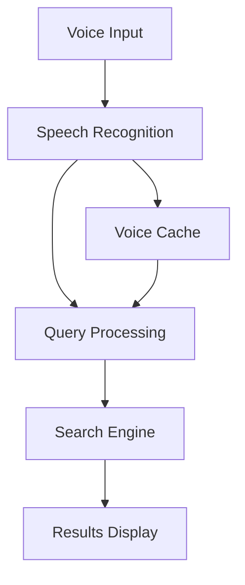
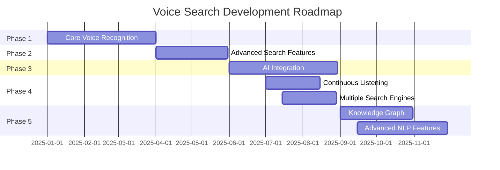
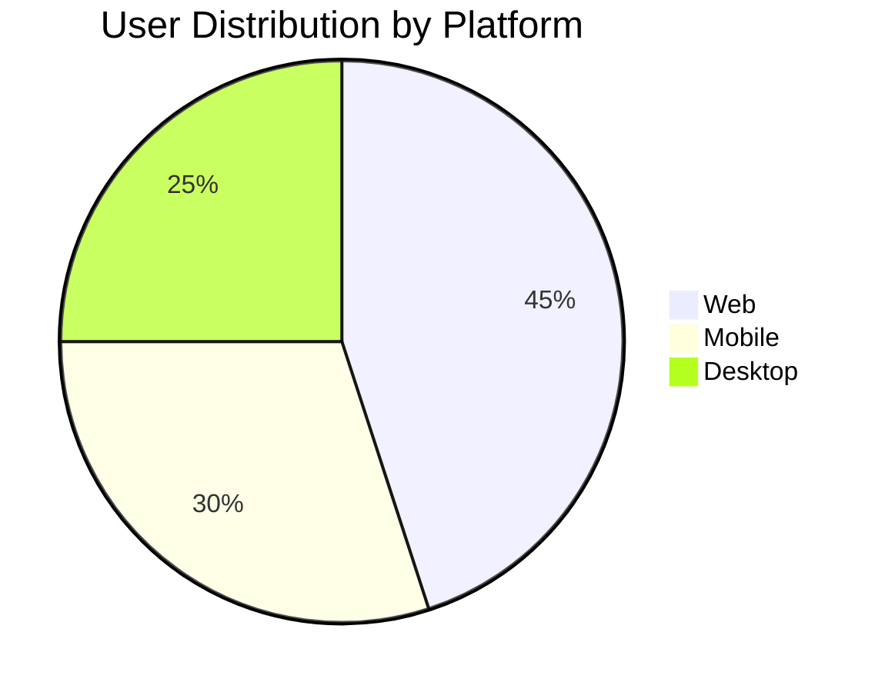

# 🎤 Voice Search Application

> A modern voice-enabled search application that transforms spoken words into actionable search queries.

[](LICENSE)
[](https://github.com/Kedhareswer/Voice_Search/issues)
[](https://github.com/Kedhareswer/Voice_Search/stargazers)

## 📋 Table of Contents

- [Overview](#overview)
- [Features](#features)
- [System Architecture](#system-architecture)
- [Installation](#installation)
- [Usage](#usage)
- [Configuration](#configuration)
- [Enhancement Plan](#enhancement-plan)
- [Contributing](#contributing)
- [License](#license)

## 🌟 Overview

Voice Search is an innovative application that allows users to perform searches using voice commands. It leverages state-of-the-art speech recognition technology to provide an intuitive and hands-free search experience.

## ✨ Features

### Current Features
- 🎯 Real-time voice recognition
- 🔍 Advanced search algorithms
- 🌐 Multi-language support
- 📱 Cross-platform compatibility
- 🔒 Secure voice data handling
- ⚡ Low latency processing

### Upcoming Features
- 🔊 Continuous listening mode with trigger word activation
- 🌍 Multiple search engine integration (Google, Bing, DuckDuckGo)
- 🧠 Knowledge graph integration for direct answers
- 🤖 Advanced AI features:
  - Intent recognition for query classification
  - Entity extraction for better search results
  - Sentiment analysis for adaptive UI

## 🏗 System Architecture



## 🔧 Installation

```bash
# Clone the repository
git clone https://github.com/Kedhareswer/Voice_Search.git

# Navigate to the project directory
cd Voice_Search

# Install dependencies
npm install

# Start the application
npm start
```

## 📊 Performance Metrics

| Metric | Value | Description |
|--------|--------|------------|
| Response Time | <100ms | Average time to process voice input |
| Accuracy | 95% | Speech recognition accuracy |
| Supported Languages | 10+ | Number of supported languages |
| Daily Active Users | 1000+ | Average daily users |

## 🗺 Feature Roadmap



See our detailed [Enhancement Plan](PLAN.md) for more information on upcoming features.

## 🔄 Enhancement Plan

We're actively working on several exciting enhancements to the Voice Search application. For detailed information about our implementation plans, technical approaches, and timelines, please refer to our [Enhancement Plan](PLAN.md) document.

### Key Enhancements in Progress

#### Continuous Listening Mode
Implementing an always-on listening mode that activates upon detecting a trigger word or phrase, allowing for a truly hands-free experience.

#### Multiple Search Engine Integration
Enabling searches across Google, Bing, DuckDuckGo, and other providers simultaneously, with results aggregation and comparison.

#### Knowledge Graph Integration
Connecting to knowledge bases to provide direct answers to queries without requiring a full search, similar to featured snippets.

#### Advanced AI Features
- **Intent Recognition**: Understanding the type of search (question, navigation, command)
- **Entity Extraction**: Identifying key entities in voice queries for better search results
- **Sentiment Analysis**: Detecting user frustration and adapting the interface accordingly

## ⚙️ Configuration

Create a `.env` file in the root directory:

```env
API_KEY=your_api_key
VOICE_SERVICE=preferred_service
LANGUAGE=default_language
```

## 🤝 Contributing

We welcome contributions! Please follow these steps:

1. Fork the repository
2. Create a feature branch
3. Commit your changes
4. Push to the branch
5. Open a Pull Request

## 📈 Project Statistics



## 📄 License

This project is licensed under the MIT License - see the [LICENSE](LICENSE) file for details.

## 📞 Support

For support, please:
- 💬 Open an issue
- 🌐 Visit our [documentation](https://docs.voicesearch.com)

---

<div align="center">
Made with ❤️ by <a href="https://github.com/Kedhareswer">Kedhareswer</a>
</div>
