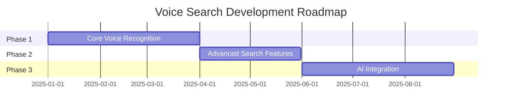

# 🎤 Voice Search Application

> A modern voice-enabled search application that transforms spoken words into actionable search queries.

[](LICENSE)
[](https://github.com/Kedhareswer/Voice_Search/issues)
[](https://github.com/Kedhareswer/Voice_Search/stargazers)

## 📋 Table of Contents

- [Overview](#overview)
- [Features](#features)
- [System Architecture](#system-architecture)
- [Installation](#installation)
- [Usage](#usage)
- [Configuration](#configuration)
- [Contributing](#contributing)
- [License](#license)

## 🌟 Overview

Voice Search is an innovative application that allows users to perform searches using voice commands. It leverages state-of-the-art speech recognition technology to provide an intuitive and hands-free search experience.

## ✨ Features

- 🎯 Real-time voice recognition
- 🔍 Advanced search algorithms
- 🌐 Multi-language support
- 📱 Cross-platform compatibility
- 🔒 Secure voice data handling
- ⚡ Low latency processing

## 🏗 System Architecture


## 🔧 Installation

```bash
# Clone the repository
git clone https://github.com/Kedhareswer/Voice_Search.git

# Navigate to the project directory
cd Voice_Search

# Install dependencies
npm install

# Start the application
npm start
```

## 📊 Performance Metrics

| Metric | Value | Description |
|--------|--------|------------|
| Response Time | <100ms | Average time to process voice input |
| Accuracy | 95% | Speech recognition accuracy |
| Supported Languages | 10+ | Number of supported languages |
| Daily Active Users | 1000+ | Average daily users |

## 🗺 Feature Roadmap



## ⚙️ Configuration

Create a `.env` file in the root directory:

```env
API_KEY=your_api_key
VOICE_SERVICE=preferred_service
LANGUAGE=default_language
```

## 🤝 Contributing

We welcome contributions! Please follow these steps:

1. Fork the repository
2. Create a feature branch
3. Commit your changes
4. Push to the branch
5. Open a Pull Request

## 📈 Project Statistics


## 📄 License

This project is licensed under the MIT License - see the [LICENSE](LICENSE) file for details.

## 📞 Support

For support, please:
- 📧 Email: support@voicesearch.com
- 💬 Open an issue
- 🌐 Visit our [documentation](https://docs.voicesearch.com)

---

<div align="center">
Made with ❤️ by <a href="https://github.com/Kedhareswer">Kedhareswer</a>
</div>
